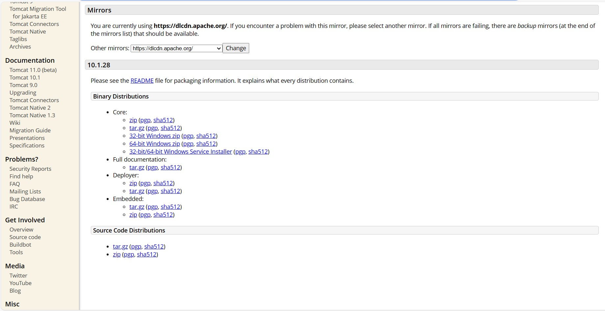
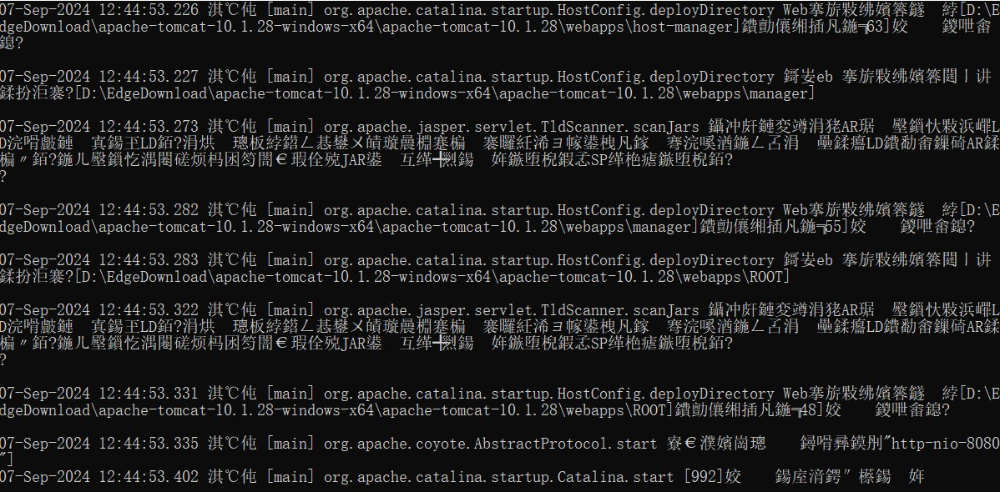
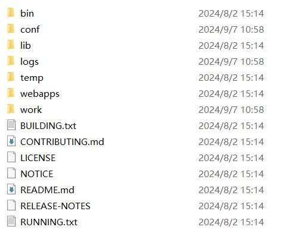

# tomcat简介
tomcat是一款支持java的服务器应用，主要负责处理http请求。其主要工作是接收请求，然后使用部署在服务器上的java应用进行数据处理，最后返回结果。
# 快速开始
1. 进入官网下载tomcat
官网网址： https://tomcat.apache.org/
下载对应版本的软件即可

2. 启动tomcat
将软件解压之后进入到bin目录下，启动
```
startup.bat //windows
startup.sh  //linux
```
启动成功后，日志如下图所示

途中显示启动端口为8080

启动成功后，访问8080端口即可验证服务器是否正常运行
```
http://localhost:8080/
```
# tomcat顶层目录简介

1. bin目录，包含相关的脚本工具。例如启动和停止tomcat。
2. conf目录，配置文件目录。
3. lib目录，tomcat运行时所需要的类库（jar）。
4. logs日志文件
5. temp，存储程序运行时的临时文件
6. webapps，将war包部署到这个文件夹下。
7. work，存储jsp编译之后的文件。

