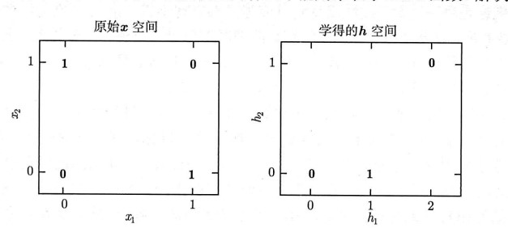
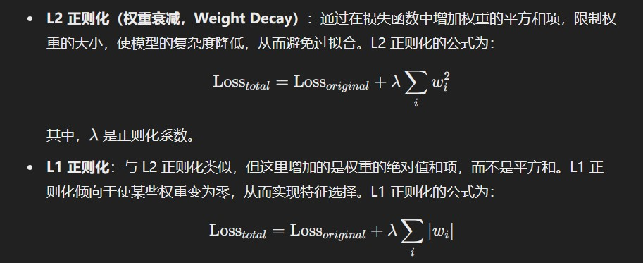

# 第一章 引言
# 第二章 线性代数
# 第三章 概率与信息论
# 第四章 数值计算
# 第五章 机器学习基础
1. 机器学习的定义：机器学习是建立一个X->Y的映射，将X映射到Y
## 机器学习的四种分类
监督学习：通过已标注的数据（输入-输出对）进行学习。常见任务有分类和回归。
无监督学习：使用未标注的数据，任务包括聚类、降维和密度估计。
半监督学习：结合少量已标注数据和大量未标注数据来进行学习。
强化学习：通过与环境的交互来学习策略，以最大化累积奖励。
## 机器学习的关键步骤
1. 模型的选择
2. 损失函数
3. 优化算法
## 监督学习的分类
1. 分类问题：预测一个类别，即离散值
2. 回归问题：预测一个连续值
## 无监督学习
1. 聚类
2. 密度估计
3. 降维
## 过拟合和欠拟合
1. 当模型在训练集上表现得很好，在测试集上表现得很差，成为过拟合。
2. 当模型在训练集上表现得不好，在测试集上表现得也不好，称为欠拟合。
# 第六章 深度前馈神经网络
## 前馈神经网络基本概念
1. 前馈神经网络是一种通过全连接神经元组成的有向无环图（DAG）。
2. 前馈神经网络一般有三层，分别是输入层、隐藏层、输出层。
3. 输入层负责接收数据，输出层负责给出最终预测结果，这两层一般不负责数值计算。中间的隐藏层进行非线性变换。
4. 神经元的工作原理一般可以表示为
```
y=f(sigma(wx+b))
```
## 前馈神经网络中的XOR问题
XOR问题在平面直角坐标系上可以表现为如下图片：

左图为XOR问题的解分布
在感性的角度上，线性模型可以理解为一个二维或更高维度的直线，由于解向量分布在四个角上，故线性模型不可能很好地拟合XOR问题。  
具体数学的证明可以通过线性拟合并计算loss得出。
## 激活函数
大多数情况下，隐藏层的输出是一个连续值，需要通过激活函数来得到最终结果。激活函数一般是输出层。  
常见的激活函数有三种，分别是Sigmoid，Tanh和ReLU。
# 第七章 深度学习中的正则化
正则化（Regularization）是减少过拟合的关键方法。正则化这个词，意思是将不规则的问题、数据、模型变得规则。
## L2正则化和L1正则化
模型的权重过大会造成过拟合，这是由于某些因素被赋予过大的权重，导致模型泛化性较低。

L1和L2正则化，在w较高的情况下，Loss会变大。
## 提前停止（Early Stopping）
提前停止减少过拟合。

## 数据增强（Data Augmentation）
通过裁剪、旋转、缩放、翻转等方法将数据增强。
## 噪声注入（Noise Injection）
## dropout
## 对抗训练（Adversarial Training）


# 第八章 深度模型中的优化


# 第九章 卷积网络
## 卷积的基本概念
1. 卷积是通过一个小的局部滤波器，在输入数据上滑动，进而提取特征。
2. 卷积核：
3. 多通道卷积：
4. 跨步（stride）
5. 填充（padding）
## 池化层（pooling layer）
池化层分为最大池化和平均池化。
池化层用来**减少**卷积层的输出尺寸。  
池化层是一种特定的下采样方法。下采样是一个更广泛的概念，在信号处理中也会用到下采样，不只是图像领域。

## 卷积神经网络的层次结构
1. 卷积层
2. 池化层
3. 全连接层

## 常见的卷积神经网络架构
1. LeNet-5
2. AlexNet
3. VGGNet
4. GoogLeNet/Inception
5. ResNet

# 第十章 循环和递归网络
RNN主要是为了满足序列建模的需求