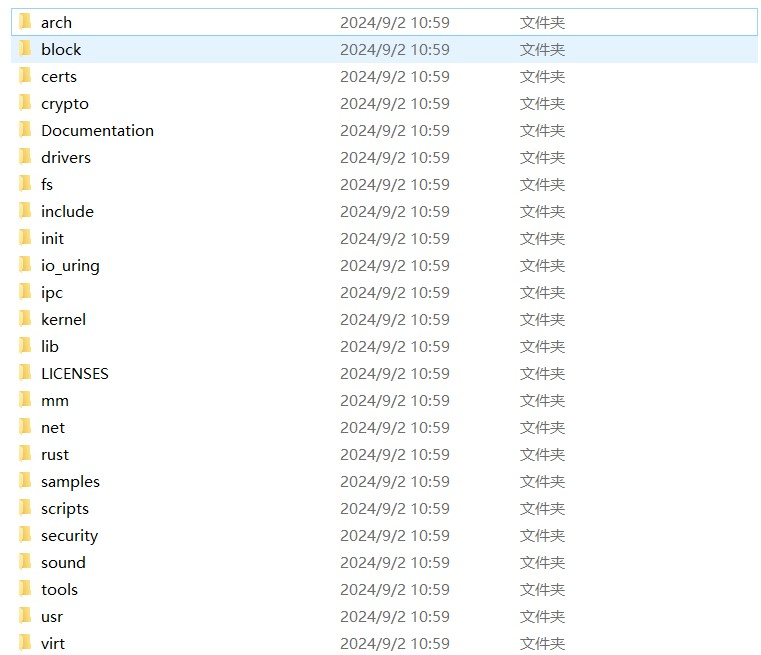

# 顶层文件结构

1. arch: 包含与不同架构相关的代码，例如 x86、ARM、MIPS 等。在这个文件夹下，将不同架构的汇编代码转换为c语言函数结构供调用。
2. block: 包含与块设备层相关的代码，例如硬盘驱动器和其他块设备的处理。
3. certs: 包含用于内核模块签名的证书文件。
4. crypto: 包含加密算法和加密 API 的实现。
5. Documentation: 包含有关内核特性的文档和内核开发的指南。
6. drivers: 包含设备驱动程序代码，如网络驱动、USB 驱动、图形驱动等。
7. fs: 包含文件系统代码，例如 ext4、xfs、btrfs 等。
8. include: 包含内核的头文件，这些文件定义了内核的 API 和内部接口。
9. init: 包含内核初始化代码，包括启动过程的早期阶段。
10. io_uring: 提供用于异步 I/O 操作的 io_uring 子系统的实现。
11. ipc: 包含进程间通信机制（如信号量、消息队列和共享内存）的实现。
12. kernel: 包含核心内核代码，如调度程序、信号处理等。
13. lib: 包含内核使用的通用库函数，例如进程创建等。
14. mm: 包含内存管理子系统的代码，例如内存分配、分页和虚拟内存管理。
15. net: 包含网络协议栈的实现，例如 TCP/IP 协议栈。
16. samples: 包含示例代码，演示如何使用内核的各种 API 和子系统。
17. scripts: 包含构建内核和开发过程中使用的脚本。
18. security: 包含与内核安全相关的代码，例如 SELinux 和 AppArmor。
19. sound: 包含与音频设备驱动和音频框架相关的代码。
20. tools: 包含用于开发和调试的工具，例如性能分析工具。
21. usr: 包含用于生成内核镜像和初始 RAM 文件系统的用户空间工具。
22. virt: 包含与虚拟化技术相关的代码，如 KVM（Kernel-based Virtual Machine）。

# 内核初始化    
内核初始化代码位于init文件夹下。
初始化代码从main.c开始执行
下面是 start_kernel函数的代码，这段代码用来启动linux内核
```c
void start_kernel(void)
{
	char *command_line;//指向初始化命令行的指针
	char *after_dashes;//指向破折号后面的指令

	set_task_stack_end_magic(&init_task);//创建初始化线程，将其放在栈中
	smp_setup_processor_id();//计算机可能有多个处理器，函数用于设置当前正在启动的处理器（CPU）的 ID。
	debug_objects_early_init();//debug object 是一个对象生命周期管理系统
	init_vmlinux_build_id(); //初始化内核的 build_id，用于标识内核版本。

	cgroup_init_early();

	local_irq_disable();
	early_boot_irqs_disabled = true;

	/*
	 * Interrupts are still disabled. Do necessary setups, then
	 * enable them.
	 */
	boot_cpu_init();//初始化引导cpu，一般计算机启动会从一个特定的cpu开始初始化
	page_address_init();//分页系统初始化
	pr_notice("%s", linux_banner);
	early_security_init();
	setup_arch(&command_line);
	setup_boot_config();
	setup_command_line(command_line);
	setup_nr_cpu_ids();
	setup_per_cpu_areas();
	smp_prepare_boot_cpu();	/* arch-specific boot-cpu hooks */
	early_numa_node_init();
	boot_cpu_hotplug_init();

	pr_notice("Kernel command line: %s\n", saved_command_line);
	/* parameters may set static keys */
	jump_label_init();
	parse_early_param();
	after_dashes = parse_args("Booting kernel",
				  static_command_line, __start___param,
				  __stop___param - __start___param,
				  -1, -1, NULL, &unknown_bootoption);
	print_unknown_bootoptions();
	if (!IS_ERR_OR_NULL(after_dashes))
		parse_args("Setting init args", after_dashes, NULL, 0, -1, -1,
			   NULL, set_init_arg);
	if (extra_init_args)
		parse_args("Setting extra init args", extra_init_args,
			   NULL, 0, -1, -1, NULL, set_init_arg);

	/* Architectural and non-timekeeping rng init, before allocator init */
	random_init_early(command_line);

	/*
	 * These use large bootmem allocations and must precede
	 * initalization of page allocator
	 */
	setup_log_buf(0);
	vfs_caches_init_early();
	sort_main_extable();
	trap_init();
	mm_core_init();
	poking_init();
	ftrace_init();

	/* trace_printk can be enabled here */
	early_trace_init();

	/*
	 * Set up the scheduler prior starting any interrupts (such as the
	 * timer interrupt). Full topology setup happens at smp_init()
	 * time - but meanwhile we still have a functioning scheduler.
	 */
	sched_init();

	if (WARN(!irqs_disabled(),
		 "Interrupts were enabled *very* early, fixing it\n"))
		local_irq_disable();
	radix_tree_init();
	maple_tree_init();

	/*
	 * Set up housekeeping before setting up workqueues to allow the unbound
	 * workqueue to take non-housekeeping into account.
	 */
	housekeeping_init();

	/*
	 * Allow workqueue creation and work item queueing/cancelling
	 * early.  Work item execution depends on kthreads and starts after
	 * workqueue_init().
	 */
	workqueue_init_early();

	rcu_init();

	/* Trace events are available after this */
	trace_init();

	if (initcall_debug)
		initcall_debug_enable();

	context_tracking_init();
	/* init some links before init_ISA_irqs() */
	early_irq_init();
	init_IRQ();
	tick_init();
	rcu_init_nohz();
	init_timers();
	srcu_init();
	hrtimers_init();
	softirq_init();
	timekeeping_init();
	time_init();

	/* This must be after timekeeping is initialized */
	random_init();

	/* These make use of the fully initialized rng */
	kfence_init();
	boot_init_stack_canary();

	perf_event_init();
	profile_init();
	call_function_init();
	WARN(!irqs_disabled(), "Interrupts were enabled early\n");

	early_boot_irqs_disabled = false;
	local_irq_enable();

	kmem_cache_init_late();

	/*
	 * HACK ALERT! This is early. We're enabling the console before
	 * we've done PCI setups etc, and console_init() must be aware of
	 * this. But we do want output early, in case something goes wrong.
	 */
	console_init();
	if (panic_later)
		panic("Too many boot %s vars at `%s'", panic_later,
		      panic_param);

	lockdep_init();

	/*
	 * Need to run this when irqs are enabled, because it wants
	 * to self-test [hard/soft]-irqs on/off lock inversion bugs
	 * too:
	 */
	locking_selftest();

#ifdef CONFIG_BLK_DEV_INITRD
	if (initrd_start && !initrd_below_start_ok &&
	    page_to_pfn(virt_to_page((void *)initrd_start)) < min_low_pfn) {
		pr_crit("initrd overwritten (0x%08lx < 0x%08lx) - disabling it.\n",
		    page_to_pfn(virt_to_page((void *)initrd_start)),
		    min_low_pfn);
		initrd_start = 0;
	}
#endif
	setup_per_cpu_pageset();
	numa_policy_init();
	acpi_early_init();
	if (late_time_init)
		late_time_init();
	sched_clock_init();
	calibrate_delay();

	arch_cpu_finalize_init();

	pid_idr_init();
	anon_vma_init();
#ifdef CONFIG_X86
	if (efi_enabled(EFI_RUNTIME_SERVICES))
		efi_enter_virtual_mode();
#endif
	thread_stack_cache_init();
	cred_init();
	fork_init();
	proc_caches_init();
	uts_ns_init();
	key_init();
	security_init();
	dbg_late_init();
	net_ns_init();
	vfs_caches_init();
	pagecache_init();
	signals_init();
	seq_file_init();
	proc_root_init();
	nsfs_init();
	pidfs_init();
	cpuset_init();
	cgroup_init();
	taskstats_init_early();
	delayacct_init();

	acpi_subsystem_init();
	arch_post_acpi_subsys_init();
	kcsan_init();

	/* Do the rest non-__init'ed, we're now alive */
	rest_init();

	/*
	 * Avoid stack canaries in callers of boot_init_stack_canary for gcc-10
	 * and older.
	 */
#if !__has_attribute(__no_stack_protector__)
	prevent_tail_call_optimization();
#endif
}
```
# 分页管理系统
在start_kernel()函数中，  
page_address_init();  
函数调用进行了分页系统的初始化。


