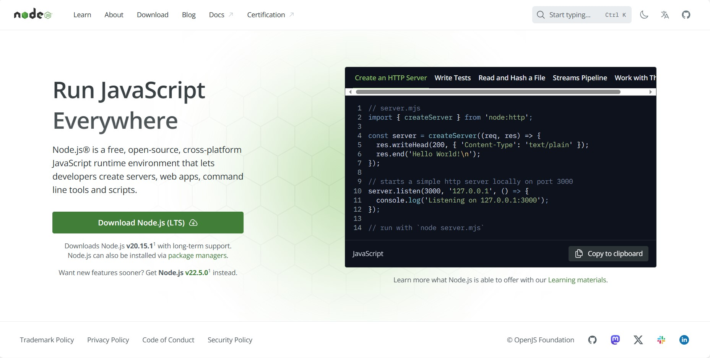
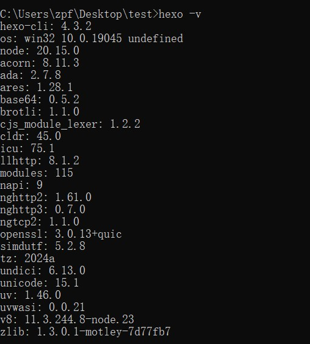
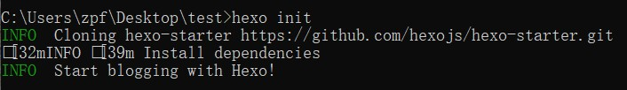

## 摘要
本文主要介绍通过hexo框架搭建个人博客，并将博客部署到github平台上。
## 所需技术简介
1. Hexo 是一个快速、简洁且高效的博客框架。 Hexo 使用 Markdown（或其他标记语言）解析文章，在几秒内，即可利用靓丽的主题生成静态网页。
2. github pages
github pages可以针对一个github账号或者一个github仓库创建一个网页。  
github pages官网：https://pages.github.com/
## Hexo安装配置
1. 安装Node.js  
Node.js官网 https://nodejs.org/  
点击download即可


2. 安装hexo  
进入cmd，输入
    ```cmd
    npm install -g hexo-cli
    ```
    安装完成后，输入
    ```
    hexo -v
    ```
    查看是否安装成功
    

3. 初始化hexo
创建一个空的项目文件夹，进入cmd，输入以下命令
    ```
    hexo init
    ```
    
    如上图所示，hexo项目创建成功