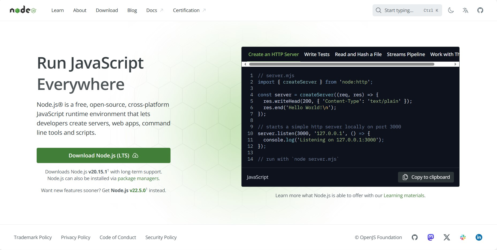
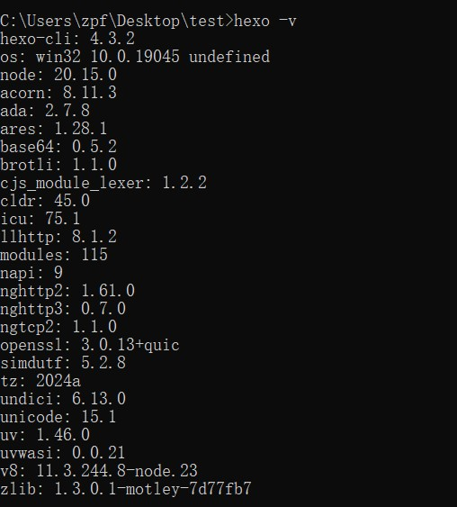
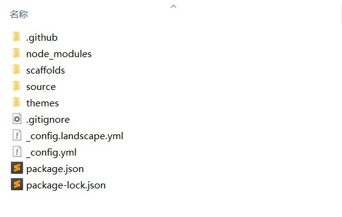
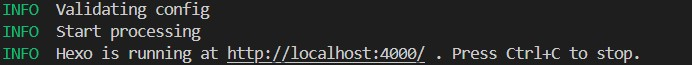
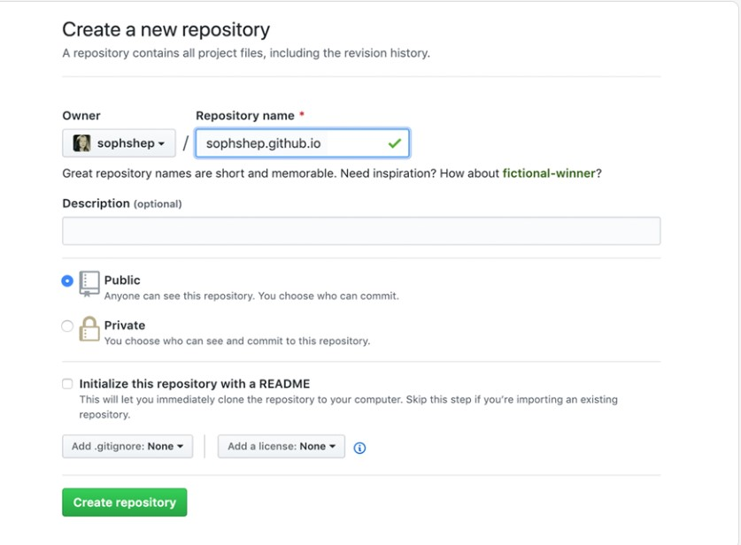
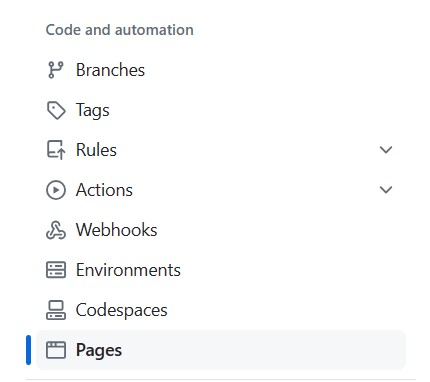
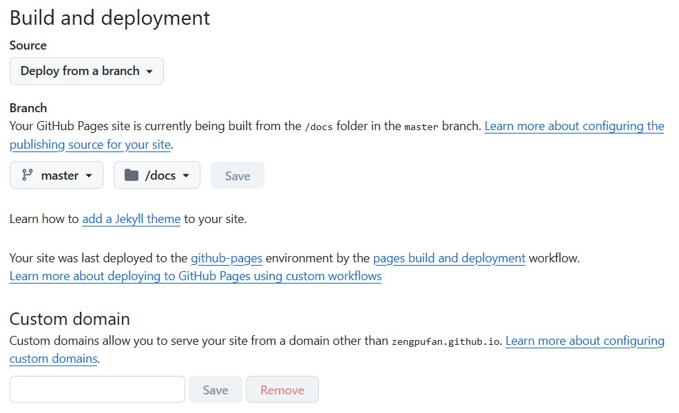
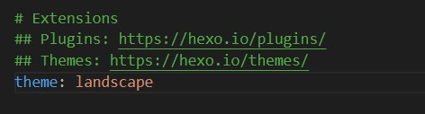

## 摘要
本文主要介绍通过hexo框架搭建个人博客，并将博客部署到github平台上。
## 所需技术简介
1. Hexo 是一个快速、简洁且高效的博客框架。 Hexo 使用 Markdown（或其他标记语言）解析文章，在几秒内，即可利用靓丽的主题生成静态网页。
2. github pages
github pages可以针对一个github账号或者一个github仓库创建一个网页。  
github pages官网：https://pages.github.com/
## Hexo安装配置
1.安装Node.js  
Node.js官网 https://nodejs.org/  
点击download即可   


2.安装hexo  
   
   进入cmd，输入
    ```cmd
   npm install -g hexo-cli
    ```
    安装完成后，输入
    ```
    hexo -v
    ```
    查看是否安装成功
    

3.初始化hexo  
    创建一个空的项目文件夹，进入cmd，输入以下命令    
    ```py
    hexo init  
    ```
    如下图所示，hexo项目创建成功  
      
      
    Hexo的初始项目结构如下:  
      
    ```py
    _config.yml 
    # 该文件是网站的配置档案，网站的配置基本上写在这里，后面会详细说明
    package.json 
    # 依赖包的配置文件
    scaffolds 
    # 模板文件夹，新建文章时，Hexo会根据scaffold创建文件夹 
    source 
    # 资源文件夹，用来存储用户资源的地方（一般指文章的原稿和相关图片资源）
    # 除 _posts 文件夹之外，开头命名为 _ (下划线)的文件 / 文件夹和隐藏的文件将会被忽略。 # Markdown 和 HTML 文件会被解析并放到 public 文件夹，而其他文件会被拷贝过去。
    themes 
    # 主题文件夹。 Hexo 会根据主题来生成静态页面
    # 主题文件夹规定网站的样式，模板文件夹规定文章的排版
    ```

4.Hexo快速开始  
   输入“生成指令”
   ```py
   hexo generate
   ```
   可以将markdown文档转换为网页  
  
   输入启动服务器指令
   ```py
   hexo server
   ```
   即可启动服务器，看到初始网站的样式
   

5.一个注意事项
   当更新内容后，必须要执行
   ```py
   hexo clean
   ```
   清除原来生成的网页，否则有些更新内容不会被部署到新的网页上。

   ## Github Pages配置
1.简介  
```c
GitHub Pages is designed to host your personal, organization, or project pages from a GitHub repository.
// github page基于一个仓库，创建一个网页
```
github page的官方文档如下：  
https://pages.github.com/

2.创建一个github仓库

在创建仓库时，有两点需要注意：  
第一，仓库的名称为
```py
xxx.github.io
# 其中xxx替换为用户名
```
第二，仓库需要设置为public 
  
3.进入仓库的设置页面，找到pages选项


其中，
Source选择deploy from a branch
文件夹图标选择/doc，这个选项是指网站的根目录，也就是主页所在的文件夹
最后一个域名根据需要进行设置

## 再次配置hexo，完成部署
1.首先，按照上文所说，打开_config.yml  
2.安好说明修改url部分
```py
# URL
## Set your site url here. For example, if you use GitHub Page, set url as 'https://username.github.io/project'
url: https://zengpufan.github.io/
permalink: :year/:month/:day/:title/
permalink_defaults:
pretty_urls:
  trailing_index: true # Set to false to remove trailing 'index.html' from permalinks
  trailing_html: true # Set to false to remove trailing '.html' from permalinks
```
3.修改Directory
```py
# Directory
source_dir: source
public_dir: docs
tag_dir: tags
archive_dir: archives
category_dir: categories
code_dir: downloads/code
i18n_dir: :lang
skip_render:
```
其中，需要注意，public_dir需要修改为docs，由于我们需要把生成的html代码放在docs下，因此需要这样修改配置  
4.修改development配置  
```py
# Deployment
## Docs: https://hexo.io/docs/one-command-deployment
deploy:
  type: git
  repo: git@github.com:zengpufan/zengpufan.github.io.git  # Github pages地址
  branch: master #部署到的分支名称
```
5.执行部署指令 
```
hexo g
hexo d
```

## 自定义主题
1.主题的相关文件存放在themes文件夹下，需要修改主题时，将自定义的主题放在该文件夹下即可。 
系统默认的主题是landscape  
2.通过修改_config.yml下的配置就可以更改博客的主题

3.主题文件的结构如下图所示  
```
my-theme/
├── _config.yml      # 主题配置文件
├── layout/          # 模板文件夹
│   ├── layout.ejs   # 布局模板
│   ├── index.ejs    # 首页模板
│   ├── post.ejs     # 文章页模板
├── source/          # 静态资源文件夹 (CSS, JS, 图片等)
│   ├── css/
│   ├── js/
│   ├── images/
└── languages/       # 语言文件夹 (可选)

```
## 撰写博客
